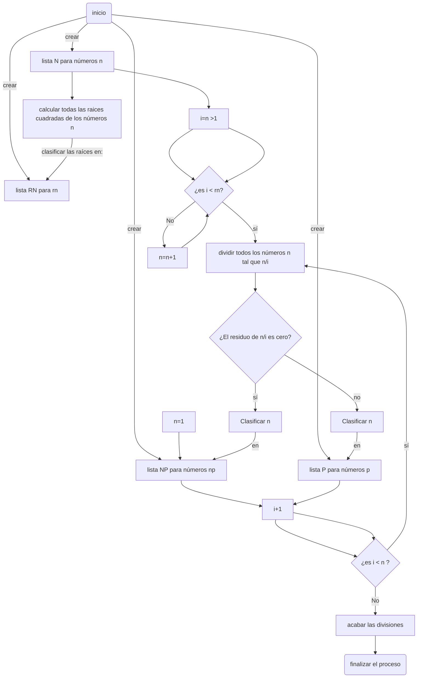
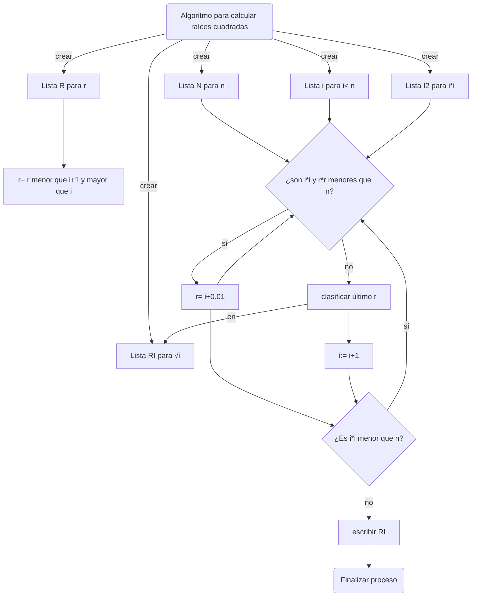

Pseudocódigo para discriminar entre números primos:
```
algoritmo de discrimincación entre números n primos y no primos

n: entero
i: entero >1
p: primo
np: no primo
rn: raíz cuadrada de n

definir listas:
    definir lista N para n
    definir lista P para P
    definir lista NP para np
    definir lista RN para rn

clasificar n:=1 en NP

calcular todas las raíces cuadradas de n y clasificarlas en la lista RN

Operacion: divisiones
    mientras (i<n):
        mientras (i< rn):
            dividir n/i
            Si 
                algún residuo de n/i = 0, entonces 
                    clasificar n en la lista NP
                    escribir("n no es primo") 
                    i:= i+1
            Sino    
                clasificar n en la lista P
                escribir("n es primo")
                i:= i+1
    Fin mientras
    Imprimir las listas( N,P,NP)
    Fin
```
Diagrama de flujo correspondiente:


Pseudocódigo para encontrar las raíces cuadradas de un número:
```
Algoritmo para calcular la raíz cuadrada de un número
n:= número entero
i:= número entero≤ n
r:= número racional >i y <i+1
i2:=i*i
r2= r*r
ri:= √i
crear listas:
    Crear lista N para n
    Crear lista I2 para I2
    Crear lista RI para ri
    Crear lista R para r
    Crear lista R2 para r2

Operación: calcular raíces cuadradas
    Mientras((i*i)≤n)
        Multiplicar(i*i) para cada i y asignar a I2

            Mientras(i2<n y r2<n)
            r=: i+0.01
            Fin Mientras
            Clasificar r en RI
    Fin mientras
Escribir RI
Fin

```
El diagrama de flujo correspondiente:


```mermaid
A(Algoritmo para calcular raíces cuadradas)-->|crear| B[Lista N para n]
A-->|crear| C[Lista i para i< n]
A-->|crear| D[Lista R para r]
A-->|crear| J[Lista RI para √i ]

D-->G[r= r menor que i+1 y mayor que i]
A-->|crear| E[Lista I2 para i*i]

B-->F{¿es i*i menor que n?}
C-->F{¿es i*i menor que n?}
E-->F{¿son i*i y r*r menores que n?}
F-->|sí| H[r= i+0.01]
H-->F
F-->|no| I[clasificar  último r]
I--> L[i:= i+1]
I-->|en| J
H--> K{¿Es i*i menor que n?}
L-->K
K--> |sí|F
K --> |no| M[escribir RI]
M -->N(Finalizar proceso)
```
