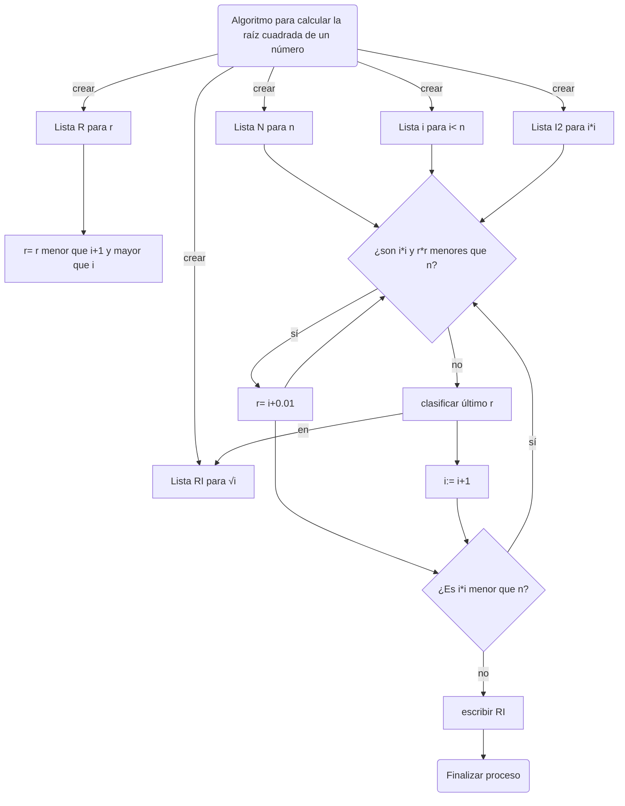

Pseudocódigo para discriminar entre números primos:
```
algoritmo de discrimincación entre números n primos y no primos

n: entero
i: entero >1
p: primo
np: no primo
rn: raíz cuadrada de n

definir listas:
    definir lista N para n
    definir lista P para P
    definir lista NP para np
    definir lista RN para rn

clasificar n:=1 en NP

calcular todas las raíces cuadradas de n y clasificarlas en la lista RN

Operacion: divisiones
    mientras (i<n):
        mientras (i< rn):
            dividir n/i
            Si 
                algún residuo de n/i = 0, entonces 
                    clasificar n en la lista NP
                    escribir("n no es primo") 
                    i:= i+1
            Sino    
                clasificar n en la lista P
                escribir("n es primo")
                i:= i+1
    Fin mientras
    Imprimir las listas( N,P,NP)
    Fin
```
Diagrama de flujo correspondiente:

[](https://mermaid.live/edit#pako:eNp9k91O4zAQhV9l5CsQoBW35U-rtguoovyUq00qdbBdGMkdF8fZ1W7TR-oLcIO0fbGdtG7LQpdIkZKj7zjnjJ2J0t5Y1VA5D53_qZ8wRLhvHeUMcn3dISZNfje9HhycVjpYDBU0M0dFROjCGAMCz19GNvgCuH_0EW4l-OYdPN4Gt1crv6d5K_4t4XcpSVgnOM_45LAvaDsJTXm-yOiE4fSw_0a7zDQ6XToMEL3BApzcAUnbAnSJJmAtGguuTrFpukghLA1Ji3fpms9qm-WGREvfuBDwevLnVXSCY0l4Nq2txXxWQedzpuurG6nBe4si1wnuZIZ-kKFFXonyby6I6OC5tMBfaFWzI-4rWb7tINiCTOnrPgJA3VF8Z9NEXq2jdbPmptyyrWXZn7cg-wrut3OrQ9QW4TajvfXIb0W421Rl2DKO_0EyD-hlqPEhDbweREGebbFaHnoCft8ZEqOj34JZB-PgZVf8riCDwUDtKxnVCMnIwZ_UrlzFJzuyuWrIo7FDLF3M5Z-YCopl9L1frFUjhtLuq3JsMNoW4WPA0VKc_gW30BXb)
Pseudocódigo para encontrar las raíces cuadradas de un número:
```
Algoritmo para calcular la raíz cuadrada de un número
n:= número entero
i:= número entero≤ n
r:= número racional >i y <i+1
i2:=i*i
r2= r*r
ri:= √i
crear listas:
    Crear lista N para n
    Crear lista I2 para I2
    Crear lista RI para ri
    Crear lista R para r
    Crear lista R2 para r2

Operación: calcular raíces cuadradas
    Mientras((i*i)≤n)
        Multiplicar(i*i) para cada i y asignar a I2

            Mientras(i2<n y r2<n)
            r=: i+0.01
            Fin Mientras
            Clasificar r en RI
    Fin mientras
Escribir RI
Fin

```
El diagrama de flujo correspondiente:


