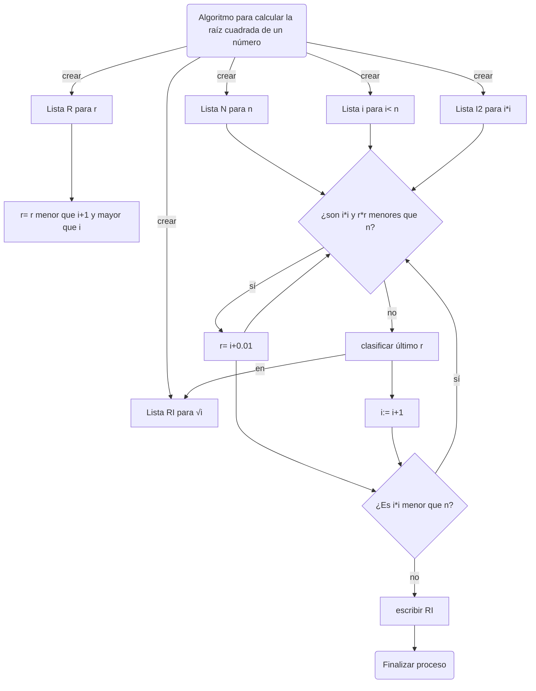

```mermaid
flowchart TD;
A(Algoritmo para calcular la raíz cuadrada de un número);
A-->|crear| B[Lista N para n];
A-->|crear| C[Lista i para i< n];
A-->|crear| D[Lista R para r];
A-->|crear| J[Lista RI para √i ];

D-->G[r= r menor que i+1 y mayor que i];
A-->|crear| E[Lista I2 para i*i];

B-->F{¿es i*i menor que n?};
C-->F{¿es i*i menor que n?};
E-->F{¿son i*i y r*r menores que n?};
F-->|sí| H[r= i+0.01];
H-->F;
F-->|no| I[clasificar  último r];
I--> L[i:= i+1];
I-->|en| J;
H--> K{¿Es i*i menor que n?};
L-->K;
K--> |sí|F;
K --> |no| M[escribir RI];
M -->N(Finalizar proceso);
```
